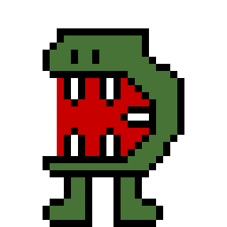

  
  <h1>Popping Monsters</h1>
  <h3>How many can you pop?<h3>

### Index
<ul>
  <a href="#screenshots"><li>Screenshots</li></a>
  <a href="#about"><li>About</li></a>
  <a href="#how-to-play"><li>How to play</li></a>
    <ul>
      <a href="#goal"><li>Goal</li></a>
      <a href="#desktop"><li>Desktop</li></a>
      <a href="#mobile"><li>Mobile</li></a>
    </ul>
  <a href="#technologies"><li>Technologies</li></a>
  <a href="#thank-you"><li>Thank you</li></a>
</ul>

### Screenshots

  |  |  |
  |--------------|------------|
  | First screen | Game round |
  
  |  |  |
  |-----------------------------------------------|------------------------------------------------|
  | The game registers the best score of the user | Best score being displayed on the first screen |
  

### About
Popping Monsters was developed as an experiment, a practice for my skills with HTML, CSS and JavaScript. 
It is a simple game (my first game 🤩️) and you can check how to play it [here](#how-to-play).

### How to play

#### Goal
Pop the monsters as many as you can. The monsters appear and stand on the screen for a while. If you do not pop them, they will disappear.
Losing 10 monsters the game ends. How many can you pop?

#### Desktop
Go to the official website [pop.joaonasc.dev](https://pop.joaonasc.dev), click on the Play button and the game will start.
Drive the cursor to the monsters, when it hits a monster, the monster will disappear and will be counted to your score. Try to not lose them!

#### Mobile
Go to the official website [pop.joaonasc.dev](https://pop.joaonasc.dev) and install/add the app to your phone. After installing it, open the game and a
Play button will be displayed. Tap this button to start the game. When the game starts, the monsters will spawn. 
Tap a monster and it will disappear being counted to your score. Try to not lose them!

### Technologies
Popping Monsters runs only with HTML, CSS and JavaScript and has no backend. 
The _best score_ is registered with the localStorage.

A manifest file was written for running it as a PWA on mobile.

### Thank you
I am glad to have you here. Please, consider to give a star for this repo and share the game with your friends. 
Feel free to use it for whatever you want, specially for learn more about the power of JavaScript :) 
It was made with a lot of fun, by me, [@nascjoao](https://github.com/nascjoao). 
THANK YOU!!! 💙️
